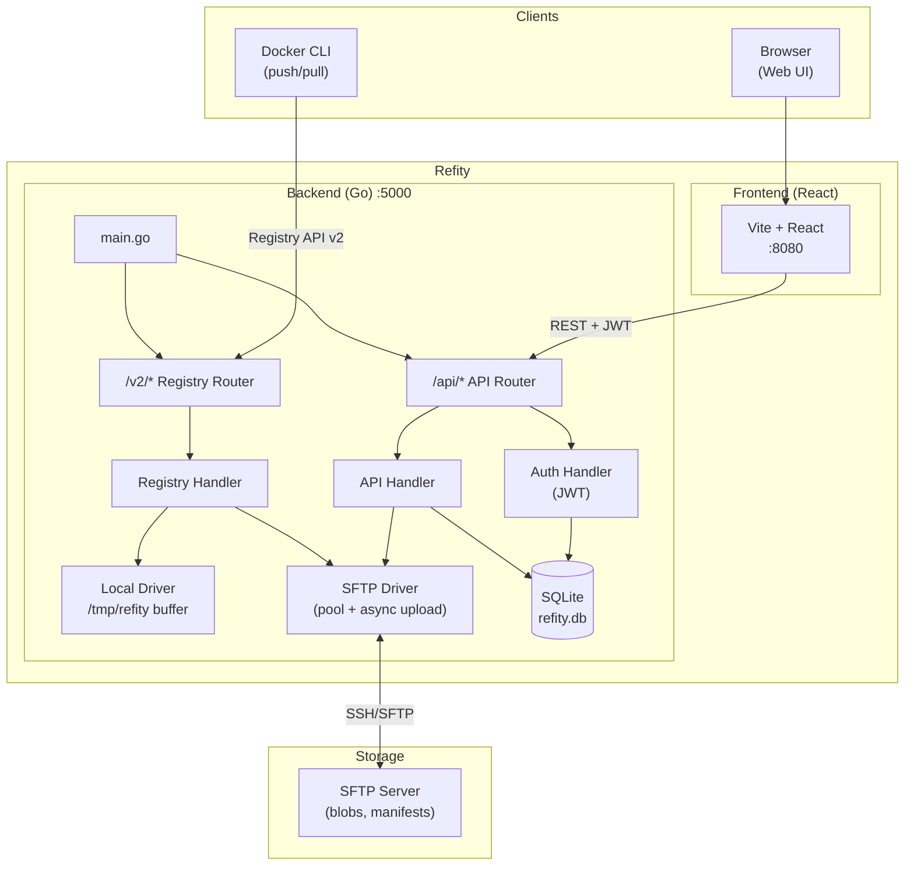
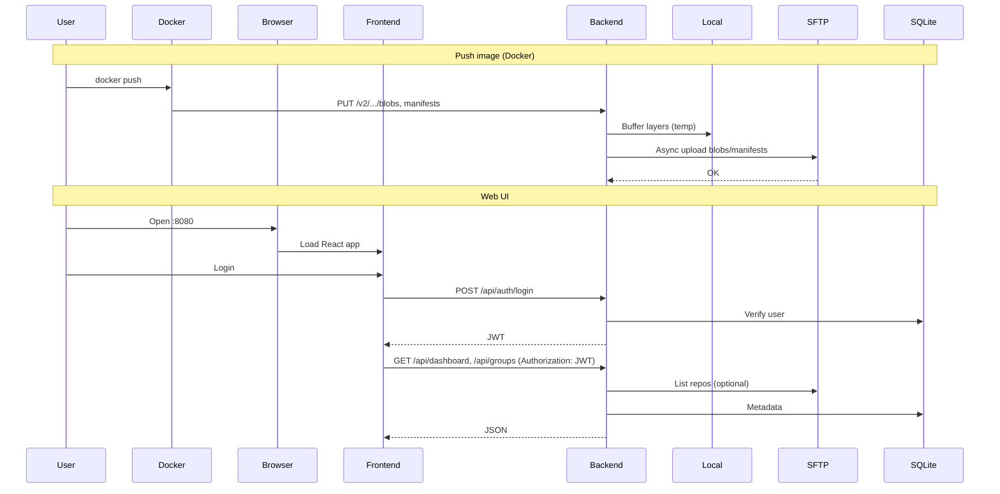
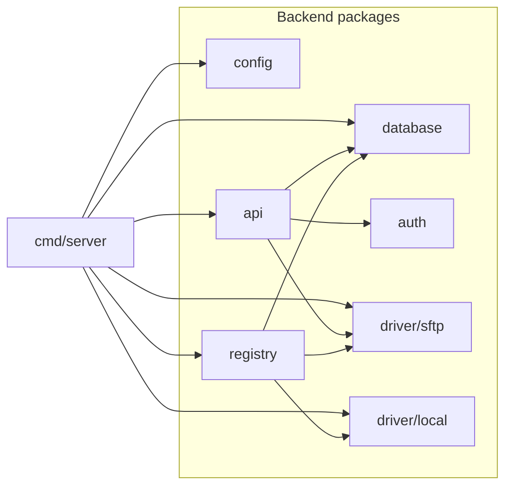

# Refity

A simple, modern Docker private registry with SFTP backend storage and React frontend.

Store and manage your container images securely on any SFTP server. Refity is designed for teams and organizations who want a self-hosted Docker registry with flexible, secure, and legacy-friendly storage options.


---

## Features

- **Docker Registry v2 API compatible**: Works with standard Docker CLI and tools
- **SFTP backend storage**: All images, manifests, and metadata are stored directly on your SFTP server
- **Modern React Frontend**: Beautiful, responsive web UI for managing repositories
- **JWT Authentication**: Secure token-based authentication with user management
- **Multi-architecture support**: Handles manifest lists for multi-arch images
- **Async SFTP upload**: Fast local buffering, then async upload to SFTP with progress and retry
- **Strict group/folder control**: No auto-create, push fails if group/folder missing (for better access control)
- **Digest validation**: Ensures image integrity and compatibility with Docker clients
- **Tag listing**: List all tags for a repository
- **Lightweight & easy to deploy**: Docker-ready with docker-compose

---

## Architecture

Refity consists of two separate services:

- **Backend** (Go): Docker Registry API and REST API for web UI (Port 5000)
- **Frontend** (React): Modern web interface for managing repositories (Port 8080)

### System Overview



### Request Flow



### Component Dependencies



---

## Quick Start

### 1. Clone the repository

```sh
git clone https://github.com/troke12/refity.git
cd refity
```

### 2. Configure environment

Copy `.env.example` to `.env` and edit with your SFTP credentials:

```env
FTP_HOST=sftp.example.com
FTP_PORT=22
FTP_USERNAME=sftpuser
FTP_PASSWORD=sftppass
```

**Optional:** `SFTP_SYNC_UPLOAD=true` — upload to SFTP before responding so files are on FTP as soon as push completes. Default `false` (async upload in background).

**FTP Usage (Hetzner):** By default the "FTP Usage" card is hidden. The dashboard shows **Total Images**, **Total Groups**, and **Total Size** only. If you use Hetzner Storage Box and want the usage card, set `FTP_USAGE_ENABLED=true` and configure `HCLOUD_TOKEN` and `HETZNER_BOX_ID` in `.env`.

**Note**: Default admin user is created automatically:
- Username: `admin`
- Password: `admin`

Change the password after first login!

### 3. Run with Docker Compose

```sh
docker-compose up -d
```

This will start both backend (port 5000) and frontend (port 8080) services.

### 4. Access the Web UI

Open your browser and navigate to:
- Frontend: http://localhost:8080
- Backend API: http://localhost:5000

### 5. Push & pull images

Tag and push your image:

```sh
docker tag nginx localhost:5000/yourgroup/nginx:latest
docker push localhost:5000/yourgroup/nginx:latest
```

---

## Development

### Backend Development

**Important**: You must run Go commands from the `backend/` directory, not from the root folder.

```sh
cd backend
go mod download
go build ./cmd/server    # Build the binary
go run ./cmd/server/main.go    # Or run directly
```

The backend will start on port 5000 (or PORT from environment variable).

### Frontend Development

```sh
cd frontend
npm install
npm run dev
```

The frontend development server uses `VITE_API_URL` (see `frontend/.env.example`) to reach the backend, typically `http://localhost:5000`.

### Production (Docker Compose) networking note

In production, the frontend container runs behind nginx and uses **same-origin** requests to `/api/*` and `/v2/*`. Nginx proxies these to the backend service.

If you rename the backend service in `docker-compose.yml`, set this on the **frontend container**:

```env
BACKEND_UPSTREAM=backend:5000
```

Important: in Docker Compose networking, the hostname is the **service name** (e.g. `backend`), not `container_name`.

---

## API Endpoints

### Authentication
- `POST /api/auth/login` - Login (returns JWT token)
- `POST /api/auth/logout` - Logout
- `GET /api/auth/me` - Get current user info

### Repositories
- `GET /api/repositories` - List all repositories
- `POST /api/repositories` - Create new repository
- `DELETE /api/repositories/{repo}` - Delete repository
- `DELETE /api/repositories/{repo}/tags/{tag}` - Delete tag

### Dashboard
- `GET /api/dashboard` - Get dashboard statistics

### Docker Registry API
- All `/v2/*` endpoints follow Docker Registry API v2 specification

---

## Default User

On first run, a default admin user is automatically created:
- **Username**: `admin`
- **Password**: `admin`
- **Role**: `admin`

**Important**: Change the password immediately after first login!

For production, set `JWT_SECRET`, `CORS_ORIGINS`, and optionally `FTP_KNOWN_HOSTS`. See [SECURITY.md](SECURITY.md).

---

## Why SFTP?

- Use existing SFTP infrastructure for secure, centralized storage
- Integrate with legacy systems or restricted environments
- Avoid cloud lock-in or object storage costs

---

## License

This project is licensed under the MIT License - see the [LICENSE](LICENSE) file for details.
