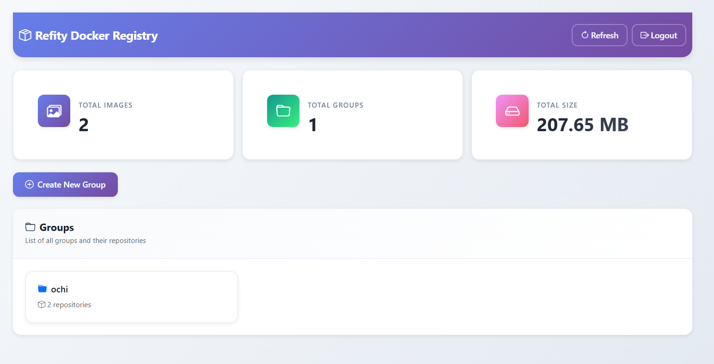

# Refity

Docker private registry with **SFTP backend storage**.

Refity stores image blobs and manifests on any SFTP server (e.g. Hetzner Storage Box) while keeping the standard Docker Registry v2 API (`docker push` / `docker pull`).



<p align="center">
  <a href="https://hub.docker.com/r/troke12/refity-backend"></a>
  <a href="https://hub.docker.com/r/troke12/refity-frontend"></a>
  <a href="https://github.com/troke12/refity"></a>
  <a href="https://troke.id/refity/"></a>
  <a href="https://troke.id/refity/docs.html"></a>
</p>

## Documentation

- Docs: [troke.id/refity/docs.html](https://troke.id/refity/docs.html)
- Why SFTP (comparison): [troke.id/refity/compare.html](https://troke.id/refity/compare.html)
- Features: [troke.id/refity/features.html](https://troke.id/refity/features.html)

## Key features

- Docker Registry HTTP API v2 (`/v2/*`)
- SFTP storage backend
- Web UI + REST API (`/api/*`) with JWT auth
- Multi-arch support (manifest lists)
- Async upload (optional sync mode)

## Quick start

```sh
git clone https://github.com/troke12/refity.git
cd refity
cp .env.example .env
docker-compose up -d
```

Open:

- Web UI: [http://localhost:8080](http://localhost:8080)
- Backend API: [http://localhost:5000](http://localhost:5000)

Default user:

- Username: `admin`
- Password: `admin`

Change it after first login.

## License

MIT. See `LICENSE`.

